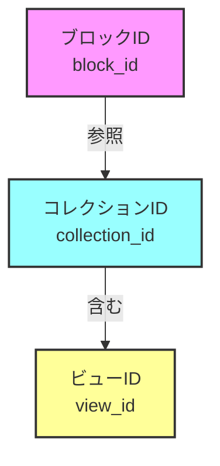

# 🔍 Notion collection_id 完全ガイド

## 📚 目次
1. [collection_idとは何か？](#collection_idとは何か)
2. [なぜcollection_idが重要なのか？](#なぜcollection_idが重要なのか)
3. [collection_idがnullになる原因](#collection_idがnullになる原因)
4. [問題の診断方法](#問題の診断方法)
5. [解決方法](#解決方法)
6. [実装例とベストプラクティス](#実装例とベストプラクティス)
7. [トラブルシューティング](#トラブルシューティング)

---

## 🎯 collection_idとは何か？

### 基本概念

Notionのデータ構造において、`collection_id`はデータベース本体を一意に識別するIDです。

```javascript
// Notionのデータ構造の例
{
  "block": {
    "ブロックID": {
      "type": "collection_view",
      "collection_id": "実際のデータベースID",  // ← これがcollection_id
      "view_ids": ["ビュー1", "ビュー2"]
    }
  }
}
```

### 3つの重要なID



#### 1. **ブロックID（block_id）**
- ページ上の配置場所を示す
- 例：`20db802c-b0c6-80e2-93d4-fc46bf2dd823`
- 同じデータベースを複数箇所に配置すると異なるIDになる

#### 2. **コレクションID（collection_id）**
- データベース本体のID
- 例：`20db802c-b0c6-80b4-aa12-000b61277830`
- 実際のデータ（行・列）が保存されている場所

#### 3. **ビューID（view_id）**
- 表示方法（リスト、テーブル、ギャラリー等）のID
- 例：`20db802c-b0c6-8066-846e-000cd27e4a85`
- 同じデータベースに複数のビューを作成可能

### 具体例で理解する

```javascript
// 正常なデータベースの構造
{
  "20db802c-b0c6-80e2-93d4-fc46bf2dd823": {  // ← ブロックID
    "value": {
      "type": "collection_view",
      "collection_id": "20db802c-b0c6-80b4-aa12-000b61277830",  // ← collection_id
      "view_ids": [
        "20db802c-b0c6-8066-846e-000cd27e4a85",  // ← リストビューのID
        "20db802c-b0c6-80b0-9446-000c7ec37b88"   // ← テーブルビューのID
      ]
    }
  }
}
```

---

## 🚨 なぜcollection_idが重要なのか？

### collection_idがある場合 ✅

```javascript
// データベースが正常に動作
{
  "collection_id": "20db802c-b0c6-80b4-aa12-000b61277830",
  "結果": {
    "データ取得": "可能",
    "ビュー表示": "正常",
    "フィルター": "動作",
    "ソート": "動作"
  }
}
```

### collection_idがない場合 ❌

```javascript
// データベースが表示されない
{
  "collection_id": null,
  "結果": {
    "データ取得": "不可能",
    "ビュー表示": "エラー",
    "表示": "Collection view is not available"
  }
}
```

### 実際の影響

1. **表示エラー**
   - データベースが空白で表示される
   - 「Collection view is not available」エラー

2. **機能制限**
   - フィルターが使えない
   - ソートができない
   - 検索が機能しない

3. **パフォーマンス問題**
   - データの取得に失敗
   - ページ読み込みが遅くなる

---

## 🔍 collection_idがnullになる原因

### 1. リンクされたデータベース（最も一般的）

```javascript
// ❌ リンクされたデータベース
{
  "type": "collection_view",
  "collection_id": null,  // nullになる
  "collection_pointer": {  // 代わりにポインタを使用
    "id": "元のcollection_id",
    "table": "collection"
  }
}

// ✅ オリジナルデータベース
{
  "type": "collection_view_page",
  "collection_id": "20db802c-b0c6-80b4-aa12-000b61277830"  // 存在する
}
```

#### リンクされたデータベースとは？

```
[オリジナルDB]
    ↓ リンク
[ページA] ← collection_idあり
    ↓ リンク
[ページB] ← collection_idなし（ポインタのみ）
    ↓ リンク
[ページC] ← collection_idなし（ポインタのみ）
```

### 2. データベースの種類による違い

#### ✅ collection_idが存在するケース

| 種類 | 説明 | collection_id |
|------|------|---------------|
| フルページDB | 独立したページとして作成 | あり |
| オリジナルDB | 最初に作成された本体 | あり |
| ルートDB | 最上位のデータベース | あり |

#### ❌ collection_idがnullになるケース

| 種類 | 説明 | collection_id |
|------|------|---------------|
| インラインDB | ページ内に埋め込み | なし |
| リンクドDB | 他DBへの参照 | なし |
| フィルタービュー | 元DBの絞り込み | なし |

### 3. 権限の問題

```javascript
// 権限チェックの例
{
  "collection_id": null,
  "permissions": {
    "type": "public_permission",
    "role": "none",  // ← 読み取り権限なし
    "allows": {
      "read": false,
      "update": false
    }
  }
}
```

### 4. Notion APIの制限

```javascript
// APIレスポンスが不完全な場合
{
  "partial": true,  // 部分的なデータ
  "collection": {
    // collection_idが含まれていない
  }
}
```

### 5. 同期とタイミングの問題

```javascript
// タイミングによる問題
const issues = {
  "作成直後": "まだ同期されていない",
  "移動直後": "参照が更新されていない",
  "削除後": "ゴースト参照が残っている",
  "権限変更後": "キャッシュが古い"
}
```

---

## 🛠️ 問題の診断方法

### 1. ブラウザコンソールでの確認

```javascript
// 📋 全データベースの状態を確認
function checkAllDatabases() {
  const results = [];
  
  Object.entries(window.recordMap?.block || {}).forEach(([blockId, blockData]) => {
    const block = blockData?.value;
    
    if (block?.type === 'collection_view' || block?.type === 'collection_view_page') {
      const result = {
        blockId,
        type: block.type,
        hasCollectionId: !!block.collection_id,
        hasPointer: !!block.collection_pointer,
        collectionId: block.collection_id,
        pointerId: block.collection_pointer?.id,
        viewCount: block.view_ids?.length || 0
      };
      
      results.push(result);
      
      // 結果を表示
      console.log(
        `${result.hasCollectionId ? '✅' : '❌'} Block: ${blockId}
        Type: ${result.type}
        Collection ID: ${result.collectionId || 'なし'}
        Pointer ID: ${result.pointerId || 'なし'}
        Views: ${result.viewCount}`
      );
    }
  });
  
  // サマリー
  const withId = results.filter(r => r.hasCollectionId).length;
  const withoutId = results.filter(r => !r.hasCollectionId).length;
  
  console.log(`
📊 サマリー:
総数: ${results.length}
✅ collection_idあり: ${withId}
❌ collection_idなし: ${withoutId}
  `);
  
  return results;
}

// 実行
checkAllDatabases();
```

### 2. 特定のデータベースを詳細診断

```javascript
// 🔍 特定のデータベースを詳しく調べる
function diagnoseDatabase(blockId) {
  const block = window.recordMap?.block?.[blockId]?.value;
  
  if (!block) {
    console.error('❌ ブロックが見つかりません');
    return;
  }
  
  const diagnosis = {
    基本情報: {
      blockId,
      type: block.type,
      created: new Date(block.created_time).toLocaleString(),
      lastEdited: new Date(block.last_edited_time).toLocaleString()
    },
    
    コレクション情報: {
      hasCollectionId: !!block.collection_id,
      collectionId: block.collection_id || 'なし',
      hasPointer: !!block.collection_pointer,
      pointerId: block.collection_pointer?.id || 'なし'
    },
    
    ビュー情報: {
      viewCount: block.view_ids?.length || 0,
      viewIds: block.view_ids || [],
      views: []
    },
    
    権限情報: {
      spaceId: block.space_id,
      permissions: block.permissions || 'なし'
    }
  };
  
  // ビューの詳細を取得
  if (block.view_ids) {
    block.view_ids.forEach(viewId => {
      const view = window.recordMap?.collection_view?.[viewId]?.value;
      if (view) {
        diagnosis.ビュー情報.views.push({
          id: viewId,
          type: view.type,
          name: view.name || '名前なし'
        });
      }
    });
  }
  
  console.log('🔍 データベース診断結果:');
  console.table(diagnosis);
  
  // 問題の特定
  if (!diagnosis.コレクション情報.hasCollectionId) {
    console.warn('⚠️ 問題: collection_idが存在しません');
    
    if (diagnosis.コレクション情報.hasPointer) {
      console.info('💡 対策: collection_pointerを使用してください');
      console.log(`ポインターID: ${diagnosis.コレクション情報.pointerId}`);
    } else {
      console.error('❌ 重大: collection_idもpointerも存在しません');
    }
  }
  
  return diagnosis;
}

// 使用例
diagnoseDatabase('your-database-block-id');
```

### 3. Node.jsでの診断スクリプト

```javascript
// check-collection-health.js
import { NotionAPI } from 'notion-client';
import dotenv from 'dotenv';
import fs from 'fs';

dotenv.config({ path: '.env.local' });

async function checkCollectionHealth() {
  const notion = new NotionAPI({
    authToken: process.env.NOTION_API_SECRET,
    activeUser: process.env.NOTION_ACTIVE_USER,
    userTimeZone: 'Asia/Tokyo'
  });
  
  try {
    const pageId = process.env.NOTION_ROOT_PAGE_ID;
    console.log('🏥 データベースの健康診断を開始します...\n');
    
    const recordMap = await notion.getPage(pageId);
    const report = {
      summary: {
        total: 0,
        healthy: 0,
        warning: 0,
        error: 0
      },
      databases: []
    };
    
    // 全データベースをチェック
    for (const [blockId, blockData] of Object.entries(recordMap.block)) {
      const block = blockData?.value;
      
      if (block?.type === 'collection_view' || block?.type === 'collection_view_page') {
        report.summary.total++;
        
        const dbInfo = {
          blockId,
          title: block.properties?.title?.[0]?.[0] || 'タイトル不明',
          type: block.type,
          status: 'healthy',
          issues: [],
          recommendations: []
        };
        
        // collection_idチェック
        if (!block.collection_id) {
          dbInfo.issues.push('collection_idが存在しません');
          dbInfo.status = 'error';
          
          if (block.collection_pointer) {
            dbInfo.recommendations.push('collection_pointerを使用してください');
            dbInfo.status = 'warning';
          }
        }
        
        // ビューチェック
        if (!block.view_ids || block.view_ids.length === 0) {
          dbInfo.issues.push('ビューが定義されていません');
          dbInfo.status = 'error';
        }
        
        // 権限チェック
        if (block.permissions?.type === 'public_permission' && 
            block.permissions?.role === 'none') {
          dbInfo.issues.push('読み取り権限がありません');
          dbInfo.status = 'error';
        }
        
        // ステータスカウント
        if (dbInfo.status === 'healthy') report.summary.healthy++;
        else if (dbInfo.status === 'warning') report.summary.warning++;
        else report.summary.error++;
        
        report.databases.push(dbInfo);
        
        // コンソール出力
        const statusIcon = {
          healthy: '✅',
          warning: '⚠️',
          error: '❌'
        }[dbInfo.status];
        
        console.log(`${statusIcon} ${dbInfo.title}`);
        if (dbInfo.issues.length > 0) {
          dbInfo.issues.forEach(issue => console.log(`   問題: ${issue}`));
          dbInfo.recommendations.forEach(rec => console.log(`   対策: ${rec}`));
        }
        console.log('');
      }
    }
    
    // レポート出力
    console.log('='.repeat(60));
    console.log('📊 診断結果サマリー:');
    console.log(`総データベース数: ${report.summary.total}`);
    console.log(`✅ 健康: ${report.summary.healthy}`);
    console.log(`⚠️ 警告: ${report.summary.warning}`);
    console.log(`❌ エラー: ${report.summary.error}`);
    
    // 詳細レポートを保存
    fs.writeFileSync(
      'database-health-report.json',
      JSON.stringify(report, null, 2)
    );
    
    console.log('\n📄 詳細レポートを database-health-report.json に保存しました');
    
  } catch (error) {
    console.error('診断中にエラーが発生しました:', error);
  }
}

checkCollectionHealth();
```

---

## 💊 解決方法

### 1. コードでの対処法

#### A. collection_pointerを使用する

```javascript
// ❌ 問題のあるコード
const collectionId = block.collection_id;
if (!collectionId) {
  throw new Error('Collection ID not found');
}

// ✅ 改善されたコード
const collectionId = block.collection_id || 
                     block.collection_pointer?.id ||
                     getBlockCollectionId(block, recordMap);

if (!collectionId) {
  console.warn('Collection ID not found, trying alternative methods...');
  // フォールバック処理
}
```

#### B. カスタムフックで対処

```typescript
// useCollectionId.ts
import { useNotionContext } from 'react-notion-x';

export function useCollectionId(block: any) {
  const { recordMap } = useNotionContext();
  
  // 複数の方法でcollection_idを取得
  const getCollectionId = () => {
    // 1. 直接取得
    if (block.collection_id) {
      return block.collection_id;
    }
    
    // 2. ポインターから取得
    if (block.collection_pointer?.id) {
      return block.collection_pointer.id;
    }
    
    // 3. ユーティリティ関数を使用
    const utilityId = getBlockCollectionId(block, recordMap);
    if (utilityId) {
      return utilityId;
    }
    
    // 4. 親ブロックから推測
    const parentId = block.parent_id;
    const parentBlock = recordMap.block[parentId]?.value;
    if (parentBlock?.collection_id) {
      return parentBlock.collection_id;
    }
    
    return null;
  };
  
  const collectionId = getCollectionId();
  const hasValidId = !!collectionId;
  
  return { collectionId, hasValidId };
}
```

#### C. コンポーネントでの実装例

```jsx
// SafeCollectionView.tsx
import React from 'react';
import { Collection } from 'react-notion-x';
import { useCollectionId } from './useCollectionId';

export const SafeCollectionView: React.FC<{ block: any }> = ({ block }) => {
  const { collectionId, hasValidId } = useCollectionId(block);
  
  if (!hasValidId) {
    // フォールバックUI
    return (
      <div className="collection-error">
        <p>⚠️ このデータベースは現在表示できません</p>
        <details>
          <summary>技術的な詳細</summary>
          <p>Block ID: {block.id}</p>
          <p>Type: {block.type}</p>
          <p>Collection ID: 見つかりません</p>
        </details>
      </div>
    );
  }
  
  // collection_idを強制的に設定
  const modifiedBlock = {
    ...block,
    collection_id: collectionId
  };
  
  return <Collection block={modifiedBlock} />;
};
```

### 2. Notionでの対処法

#### A. フルページデータベースに変換

```
1. インラインデータベースを右クリック
2. 「フルページで開く」を選択
3. 新しいページとして保存
4. 元の場所にリンクとして配置
```

#### B. データベースを再作成

```
1. 新しいページを作成
2. /table または /list で新規データベース作成
3. 既存のデータをインポート
4. 古いデータベースを削除
```

#### C. 権限設定の確認

```
1. データベースページの右上「共有」をクリック
2. 「ウェブで公開」を有効化
3. 「検索エンジンのインデックスを許可」も有効化
4. 権限を「読み取り可能」以上に設定
```

### 3. APIレベルでの対処

```javascript
// notion-api-helper.js
class NotionAPIHelper {
  constructor(notion) {
    this.notion = notion;
  }
  
  async getCollectionWithFallback(pageId) {
    try {
      // 通常の取得
      const recordMap = await this.notion.getPage(pageId);
      
      // collection_idの検証と修復
      const fixedRecordMap = this.fixMissingCollectionIds(recordMap);
      
      return fixedRecordMap;
    } catch (error) {
      console.error('Failed to get collection:', error);
      throw error;
    }
  }
  
  fixMissingCollectionIds(recordMap) {
    const collectionPointers = new Map();
    
    // まず、すべてのcollection_pointerを収集
    Object.entries(recordMap.block).forEach(([id, data]) => {
      const block = data?.value;
      if (block?.collection_pointer?.id) {
        collectionPointers.set(id, block.collection_pointer.id);
      }
    });
    
    // collection_idがないブロックを修復
    Object.entries(recordMap.block).forEach(([id, data]) => {
      const block = data?.value;
      if (block && !block.collection_id && collectionPointers.has(id)) {
        // collection_idを追加
        block.collection_id = collectionPointers.get(id);
        console.log(`Fixed collection_id for block ${id}`);
      }
    });
    
    return recordMap;
  }
}
```

---

## 🏆 実装例とベストプラクティス

### 1. 堅牢なコレクションラッパー

```typescript
// RobustCollection.tsx
import React, { useMemo } from 'react';
import dynamic from 'next/dynamic';
import { useNotionContext } from 'react-notion-x';

const Collection = dynamic(() =>
  import('react-notion-x/build/third-party/collection').then(m => m.Collection),
  { ssr: false }
);

interface Props {
  block: any;
  className?: string;
}

export const RobustCollection: React.FC<Props> = ({ block, className }) => {
  const { recordMap } = useNotionContext();
  
  // メモ化されたcollection_id取得
  const collectionData = useMemo(() => {
    const methods = [
      // 方法1: 直接取得
      () => block.collection_id,
      
      // 方法2: ポインター使用
      () => block.collection_pointer?.id,
      
      // 方法3: 関連ブロックから取得
      () => {
        const viewId = block.view_ids?.[0];
        if (viewId) {
          const view = recordMap.collection_view?.[viewId]?.value;
          return view?.collection_id;
        }
        return null;
      },
      
      // 方法4: 親ブロックから取得
      () => {
        const parent = recordMap.block[block.parent_id]?.value;
        return parent?.collection_id;
      }
    ];
    
    for (const method of methods) {
      try {
        const id = method();
        if (id) return { id, method: method.name };
      } catch (e) {
        continue;
      }
    }
    
    return null;
  }, [block, recordMap]);
  
  // エラーハンドリング
  if (!collectionData) {
    return (
      <div className="notion-collection-error">
        <h3>⚠️ データベースを表示できません</h3>
        <p>このデータベースは現在利用できない可能性があります。</p>
        <details>
          <summary>詳細情報</summary>
          <pre>{JSON.stringify({
            blockId: block.id,
            type: block.type,
            hasViewIds: !!block.view_ids,
            viewCount: block.view_ids?.length || 0
          }, null, 2)}</pre>
        </details>
      </div>
    );
  }
  
  // 修正されたブロックを作成
  const enhancedBlock = {
    ...block,
    collection_id: collectionData.id
  };
  
  return (
    <div className={className}>
      <Collection block={enhancedBlock} />
      {process.env.NODE_ENV === 'development' && (
        <div style={{ fontSize: '0.8em', opacity: 0.5 }}>
          Collection ID obtained via: {collectionData.method}
        </div>
      )}
    </div>
  );
};
```

### 2. グローバル設定での対処

```javascript
// lib/notion-config.ts
export const notionConfig = {
  // collection_id修復を有効化
  fixMissingCollectionIds: true,
  
  // フォールバック動作
  collectionFallback: {
    usePointer: true,
    searchParent: true,
    maxRetries: 3
  },
  
  // デバッグモード
  debug: {
    logMissingIds: true,
    showWarnings: true
  }
};

// lib/notion-client-wrapper.ts
import { NotionAPI } from 'notion-client';
import { notionConfig } from './notion-config';

export class EnhancedNotionAPI extends NotionAPI {
  async getPage(pageId: string, options = {}) {
    const recordMap = await super.getPage(pageId, options);
    
    if (notionConfig.fixMissingCollectionIds) {
      this.fixCollectionIds(recordMap);
    }
    
    return recordMap;
  }
  
  private fixCollectionIds(recordMap: any) {
    const fixes = [];
    
    Object.entries(recordMap.block).forEach(([blockId, blockData]: [string, any]) => {
      const block = blockData?.value;
      
      if (this.needsCollectionIdFix(block)) {
        const fixedId = this.findCollectionId(block, recordMap);
        
        if (fixedId) {
          block.collection_id = fixedId;
          fixes.push({ blockId, fixedId });
        }
      }
    });
    
    if (fixes.length > 0 && notionConfig.debug.logMissingIds) {
      console.log(`Fixed ${fixes.length} missing collection IDs:`, fixes);
    }
  }
  
  private needsCollectionIdFix(block: any): boolean {
    return (
      block &&
      (block.type === 'collection_view' || block.type === 'collection_view_page') &&
      !block.collection_id
    );
  }
  
  private findCollectionId(block: any, recordMap: any): string | null {
    // ここに複数の取得方法を実装
    return block.collection_pointer?.id || null;
  }
}
```

### 3. React Contextでの管理

```typescript
// contexts/CollectionContext.tsx
import React, { createContext, useContext, ReactNode } from 'react';

interface CollectionContextType {
  getCollectionId: (block: any) => string | null;
  isCollectionValid: (block: any) => boolean;
  fixCollection: (block: any) => any;
}

const CollectionContext = createContext<CollectionContextType | null>(null);

export const CollectionProvider: React.FC<{ children: ReactNode }> = ({ children }) => {
  const getCollectionId = (block: any): string | null => {
    // 実装
    return block.collection_id || block.collection_pointer?.id || null;
  };
  
  const isCollectionValid = (block: any): boolean => {
    return !!getCollectionId(block);
  };
  
  const fixCollection = (block: any): any => {
    const id = getCollectionId(block);
    if (!id) return block;
    
    return {
      ...block,
      collection_id: id
    };
  };
  
  return (
    <CollectionContext.Provider value={{ getCollectionId, isCollectionValid, fixCollection }}>
      {children}
    </CollectionContext.Provider>
  );
};

export const useCollection = () => {
  const context = useContext(CollectionContext);
  if (!context) {
    throw new Error('useCollection must be used within CollectionProvider');
  }
  return context;
};
```

---

## 🔧 トラブルシューティング

### よくある問題と解決策

#### 1. 「Collection view is not available」エラー

```javascript
// 問題の診断
console.log('Block:', block);
console.log('Has collection_id:', !!block.collection_id);
console.log('Has pointer:', !!block.collection_pointer);

// 解決策
const collectionId = block.collection_id || 
                     block.collection_pointer?.id || 
                     findAlternativeId(block);
```

#### 2. データベースが空白で表示される

```javascript
// チェックリスト
const troubleshoot = {
  "collection_idは存在するか": !!block.collection_id,
  "ビューIDは存在するか": block.view_ids?.length > 0,
  "コレクションデータは存在するか": !!recordMap.collection,
  "権限は適切か": checkPermissions(block)
};

console.table(troubleshoot);
```

#### 3. 特定のデータベースだけ動作する

```javascript
// 動作するDBと動作しないDBを比較
function compareDataases(workingId, brokenId) {
  const working = window.recordMap.block[workingId]?.value;
  const broken = window.recordMap.block[brokenId]?.value;
  
  const comparison = {
    working: {
      type: working?.type,
      hasCollectionId: !!working?.collection_id,
      viewCount: working?.view_ids?.length || 0
    },
    broken: {
      type: broken?.type,
      hasCollectionId: !!broken?.collection_id,
      viewCount: broken?.view_ids?.length || 0
    }
  };
  
  console.table(comparison);
}
```

### デバッグチェックリスト

- [ ] collection_idが存在するか確認
- [ ] collection_pointerが存在するか確認
- [ ] ビューIDが正しく設定されているか確認
- [ ] 権限設定を確認
- [ ] Notionでデータベースが正常に表示されるか確認
- [ ] キャッシュをクリアして再試行
- [ ] 開発者ツールでエラーログを確認

### 緊急対処法

```javascript
// 最終手段: すべてのDBに同じcollection_idを使用（テスト用）
function emergencyFix() {
  const WORKING_COLLECTION_ID = "20db802c-b0c6-80b4-aa12-000b61277830";
  
  Object.values(window.recordMap.block).forEach(blockData => {
    const block = blockData?.value;
    if (block && !block.collection_id && 
        (block.type === 'collection_view' || block.type === 'collection_view_page')) {
      block.collection_id = WORKING_COLLECTION_ID;
      console.warn('Emergency fix applied to:', block.id);
    }
  });
}
```

---

## 📚 参考資料とリンク

- [Notion API Documentation](https://developers.notion.com/)
- [react-notion-x GitHub](https://github.com/NotionX/react-notion-x)
- [notion-client Documentation](https://github.com/NotionX/notion-client)

## ⚠️ 注意事項：ビューの自動切り替えについて

### 避けるべきアプローチ

#### ❌ ビューを強制的に変更するスクリプト

```javascript
// 悪い例：特定のビューを強制する
function forceListView() {
  const viewTabs = document.querySelectorAll('.notion-collection-view-tabs-content-item');
  viewTabs.forEach(tab => {
    if (tab.textContent.includes('リスト')) {
      tab.click(); // ユーザーの選択を無視して強制変更
    }
  });
}
```

**問題点：**
1. **ユーザー体験の破壊** - Notionで設定したビューが無視される
2. **データベース表示の干渉** - レンダリング中の操作により表示エラー
3. **予期しない動作** - カレンダー、ギャラリー等の他ビューが使えない
4. **パフォーマンス問題** - DOM操作によるレンダリング遅延

### 実際に発生した問題

```javascript
// 問題のあったスクリプトの例
// fix-database-views.js として実装されていた
(function() {
  // データベースのビューを自動的にリストビューに切り替える
  function fixDatabaseViews() {
    const collections = document.querySelectorAll('.notion-collection');
    collections.forEach(collection => {
      // ビュータブを探して強制的にクリック
      const viewTabs = collection.querySelectorAll('.notion-collection-view-tabs-content-item');
      // ... リストビューを探してクリック
    });
  }
  
  // 複数回実行してしまう
  setTimeout(fixDatabaseViews, 500);
  setTimeout(fixDatabaseViews, 1000);
  // ...
})();
```

**発生した問題：**
- データベースが完全に表示されない
- 初期レンダリングが中断される
- ユーザーが選択したビューが勝手に変更される

### ✅ 正しいアプローチ

#### 1. Notionの設定を尊重する

```javascript
// 良い例：ビューの状態を読み取るだけ
function getCurrentView() {
  const activeTab = document.querySelector('.notion-collection-view-tabs-content-item-active');
  if (activeTab) {
    console.log('Current view:', activeTab.textContent);
  }
  // 変更はしない、情報取得のみ
}
```

#### 2. ユーザーの操作をサポートする

```javascript
// ビュー切り替えボタンを追加（ユーザーが選択できる）
function addViewSwitcher() {
  const container = document.querySelector('.notion-collection');
  if (!container) return;
  
  const switcher = document.createElement('div');
  switcher.innerHTML = `
    <button onclick="switchToView('list')">リスト表示</button>
    <button onclick="switchToView('table')">テーブル表示</button>
  `;
  container.prepend(switcher);
}
```

#### 3. エラーハンドリングの改善

```javascript
// データベース表示を妨げない安全な処理
function safelyProcessDatabase() {
  // レンダリング完了を待つ
  if (document.readyState !== 'complete') {
    window.addEventListener('load', safelyProcessDatabase);
    return;
  }
  
  // IntersectionObserverで表示を確認
  const observer = new IntersectionObserver((entries) => {
    entries.forEach(entry => {
      if (entry.isIntersecting && entry.target.offsetHeight > 0) {
        // 表示が完了してから処理
        console.log('Database rendered:', entry.target);
      }
    });
  });
  
  document.querySelectorAll('.notion-collection').forEach(el => {
    observer.observe(el);
  });
}
```

### 教訓

1. **Notionの設定を上書きしない** - ユーザーが設定したビューは尊重する
2. **DOM操作は慎重に** - 特に初期レンダリング中は避ける
3. **ユーザーに選択肢を** - 自動化より操作性を重視
4. **テストを十分に** - 本番環境での動作確認は必須

---

## 🎯 まとめ

1. **collection_idは重要** - データベース本体へのアクセスに必須
2. **nullになる原因は様々** - リンクDB、権限、API制限など
3. **複数の解決策がある** - コード対処、Notion設定、API修正
4. **防御的プログラミング** - 常にフォールバックを用意
5. **ユーザー設定を尊重** - 自動化は慎重に、ユーザーの選択を優先

この問題に遭遇したら、まず診断ツールで原因を特定し、適切な解決策を選択してください。